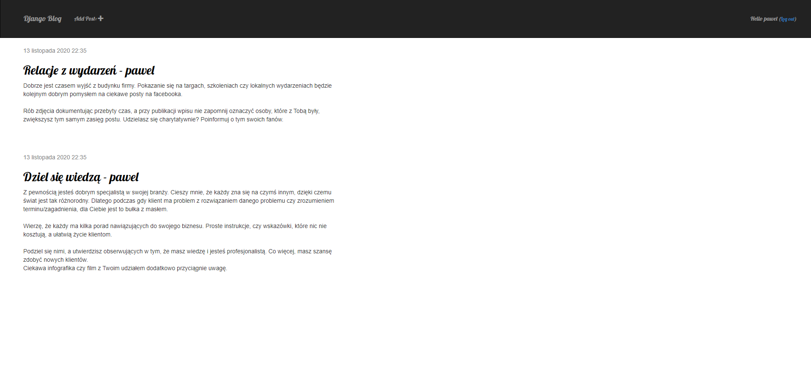
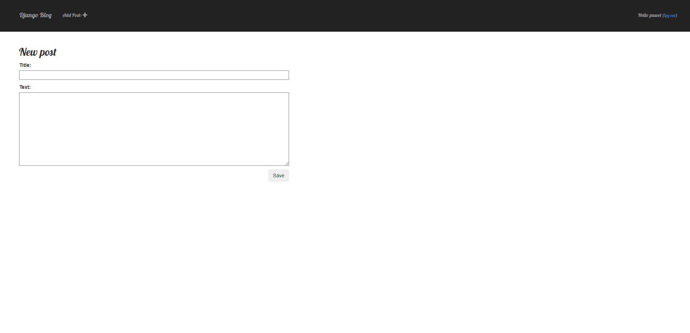
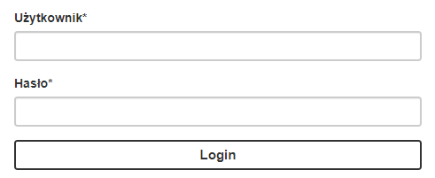

# aplikacje-internetowe-Lipski_LAB1-185ic

# Link do strony: https://blog-ringo.herokuapp.com/

### Strona główna bloga

### Osoby zalogowane mają możliwość dodawania postów

### oraz edycji i usuwania postów

### modyfikowania postów

### logowanie

### rejestracja

<b>
<h1> :heavy_exclamation_mark::boom: --- Update Część 2 Laborki --- :boom::heavy_exclamation_mark: </h1>
</b>

### Opcja zmieny hasła

###

### Opcja resetu hasła

#### Problemem jest to, że po zmarnowanych 10h wciąż nie udało mi się tego zmienić :disappointed_relieved::gun:

### Ale przynajmniej poczta dochodzi :tada::tada::unamused::tada::tada:

