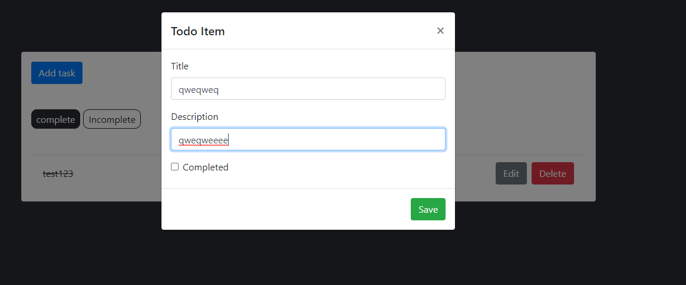
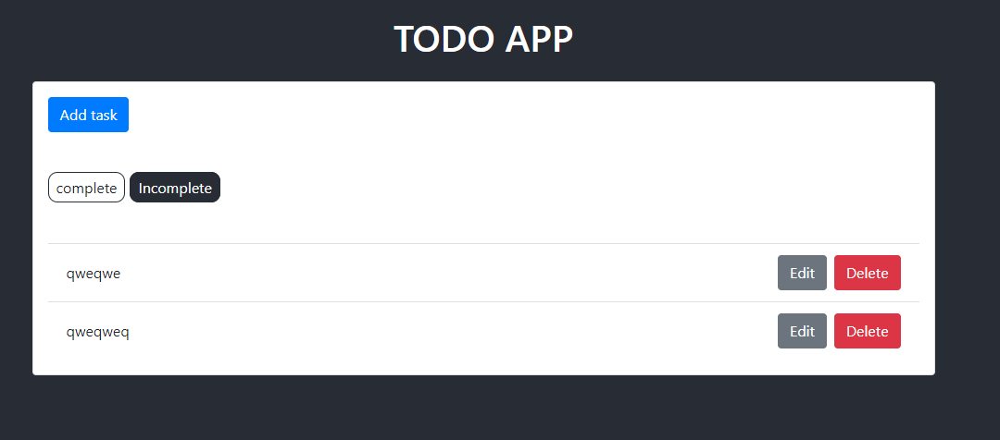
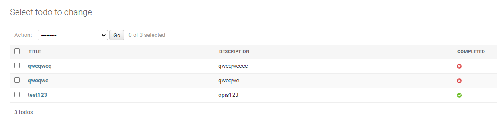

# Aplikacje internetowe Paweł Lipski 185IC Lab10

#### Django + React (aplikacja typu ToDo)
#### Dodanie nowego elementu do listy.

#### Lista elementów których aktualny stan to "incompleted".

#### Widok danych w bazie danych.

