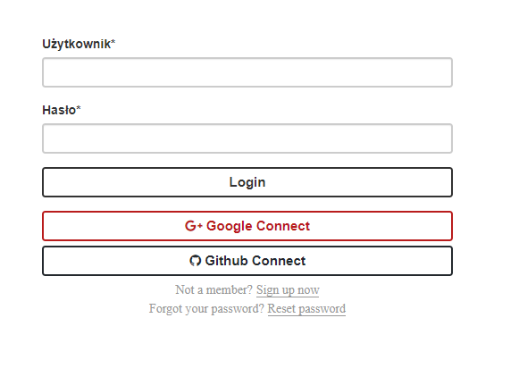
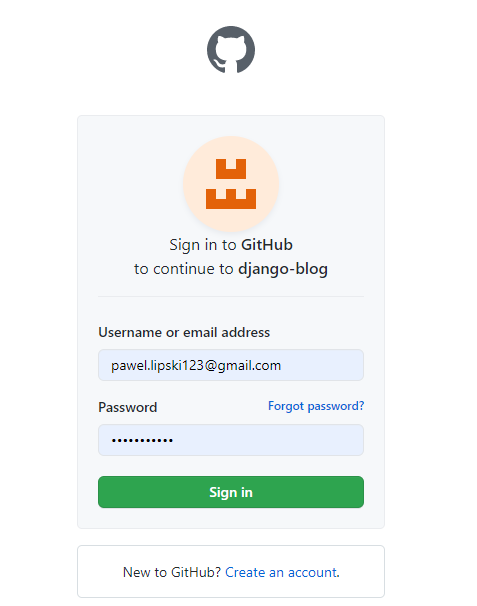
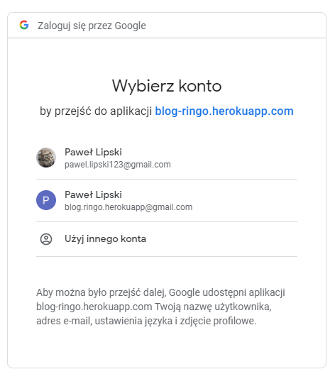

# Aplikacje internetowe Paweł Lipski 185IC Lab3

# Link do strony: https://blog-ringo.herokuapp.com/

### Możliwość logowania za pomocą social mediów (Github lub Google)

### Logowanie za pomocą konta Github

### Moja nazwa użytkownika po zalogowaniu na pomocą Github

### Logowanie za pomocą konta Google

