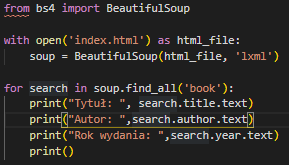
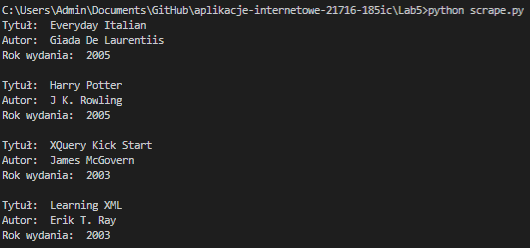
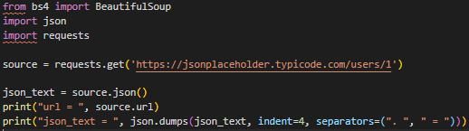
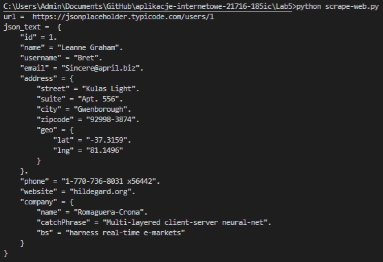
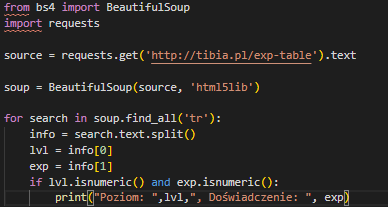
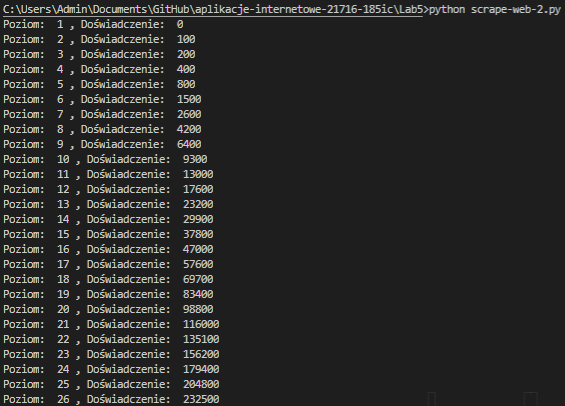
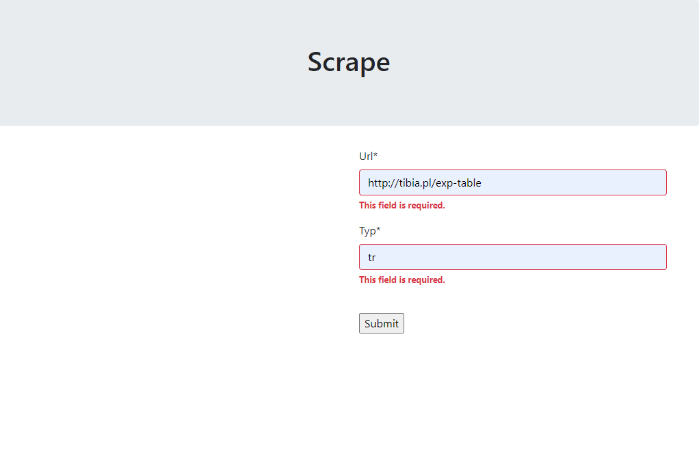
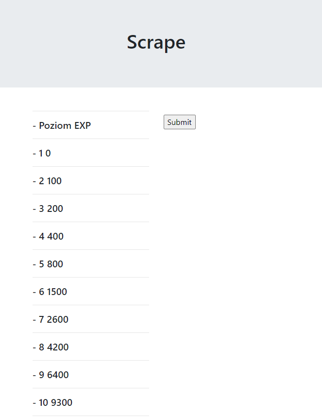

# Aplikacje internetowe Paweł Lipski 185IC Lab5

> #### `pip3 install html5lib requests lxml bs4`

> ### Pobranie danych lxml

> ### Wynik kodu:

> ### Pobranie danych json

> ### Wynik kodu:

> ### Pobranie danych html5lib

> ### Wynik kodu:

> ### Scrap z użyciem django
> #### w pole url należy podać link, a do pola typ należy podać jakie `<tagmane>` ma być wyszukany

> ### Wynik działania programu

 