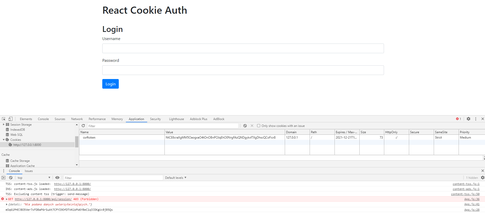

# Aplikacje internetowe Paweł Lipski 185IC Lab4

### Ekran logowania
### W Cookies można zauważyć `crsftoken`

### Po zalogowaniu, w Cookies powstaje `sessionid`

###  Po pomyślnym zalogoawniu, w konsoli wyświetla się komunikat `Successfully logged in.` 
###  Kliknięcie `WhoAmI`, w konsoli wyświetla login użytkownika
###  Po pomyślnym wylogowaniu, w konsoli wyświetla się komunikat `Successfully logged out.` 

