# Aplikacje internetowe Paweł Lipski 185IC Lab7

#### 

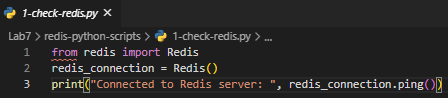

#### 

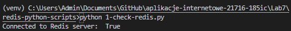

#### 

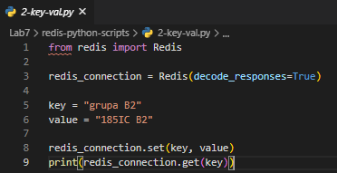

#### 

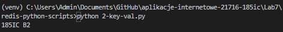

#### 

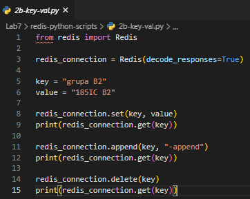

#### 

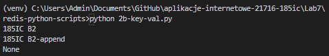

#### 

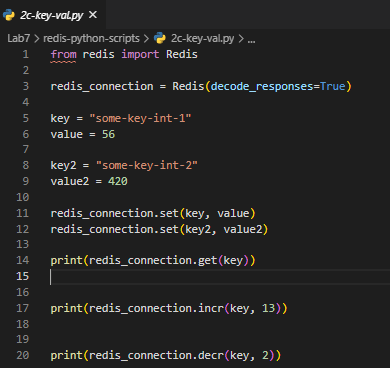

#### 

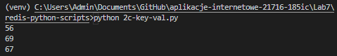

#### 

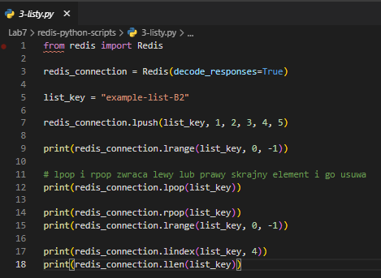

#### 

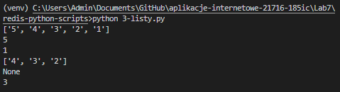

#### 

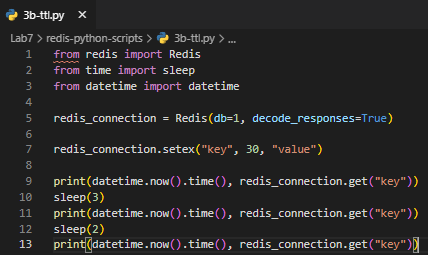

#### 

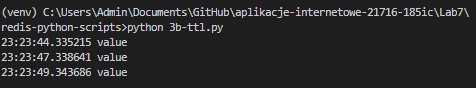

#### 

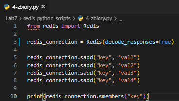

#### 

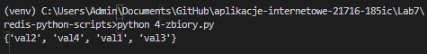

#### 

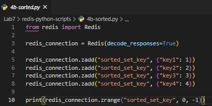

#### 

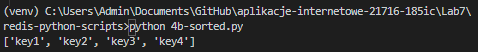

#### 

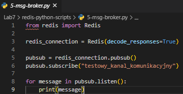

#### 

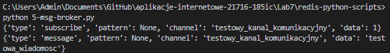

#### 

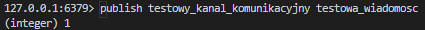

#### 

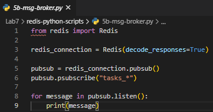

#### 

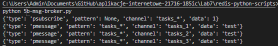

#### 

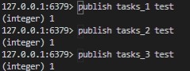

#### 

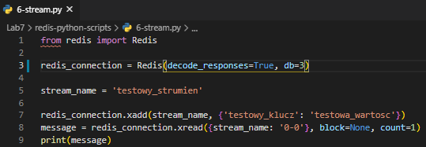

#### 

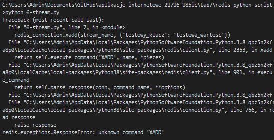

#### 

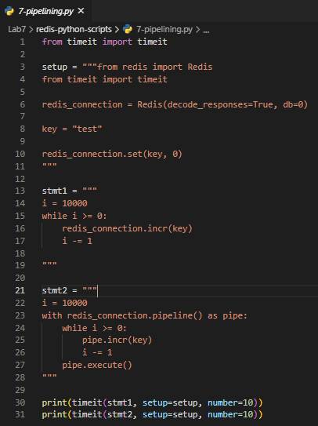

#### 

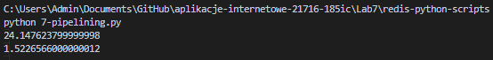

#### 

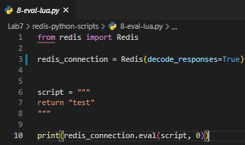

#### 

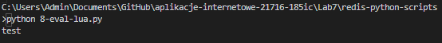

#### 

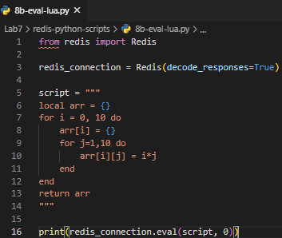

#### 

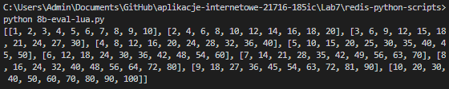

#### 

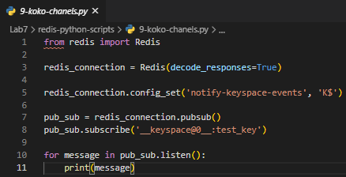

#### 

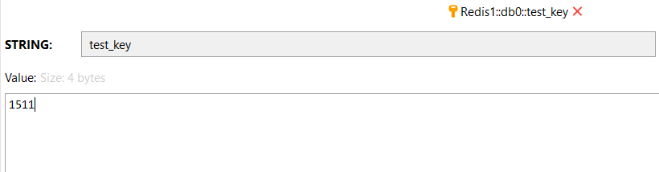

#### 

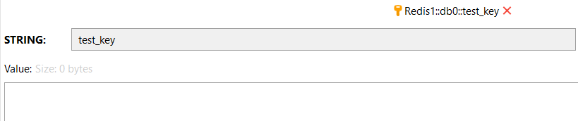

#### 

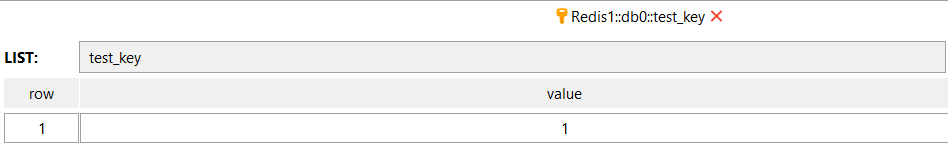

#### 

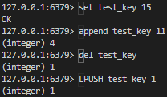

#### 

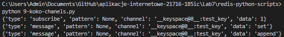

#### 

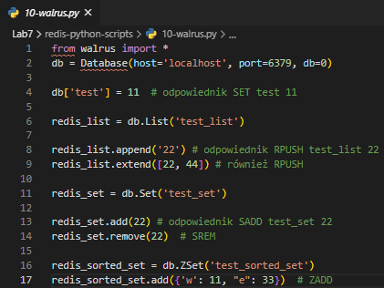

#### 

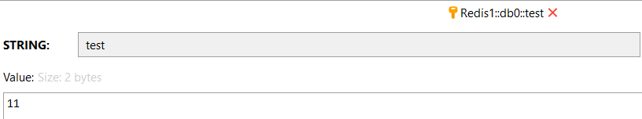

#### 

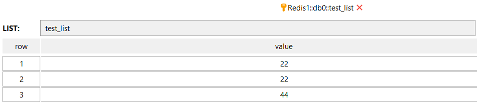

#### 

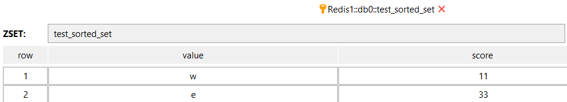

#### 

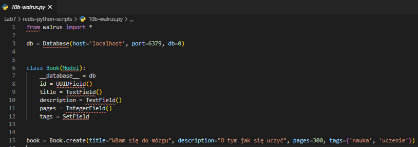

#### 

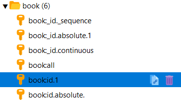

#### 

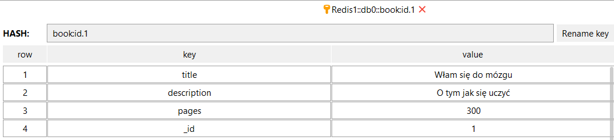

#### Wygląd aplikacji

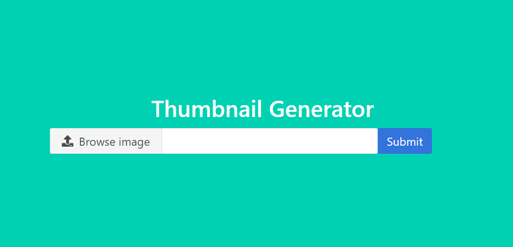

 #### Wprowadzenie obrazu

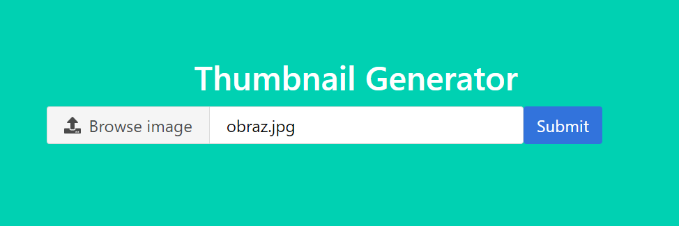

#### Przetwarzanie obrazu

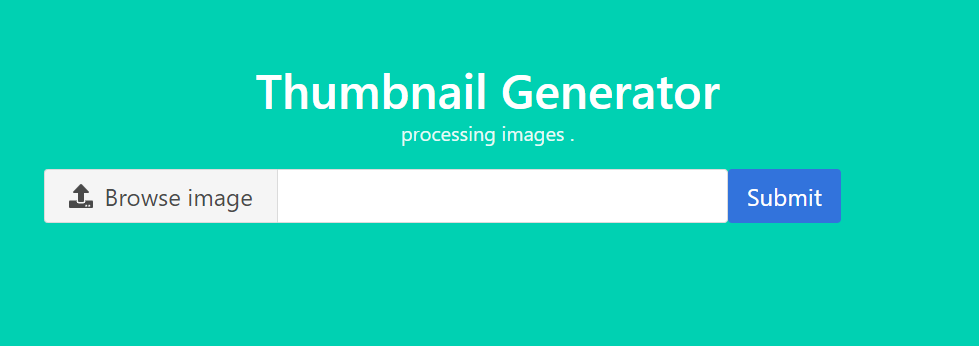

#### Obraz pojawił się w media\images

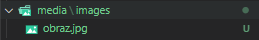

