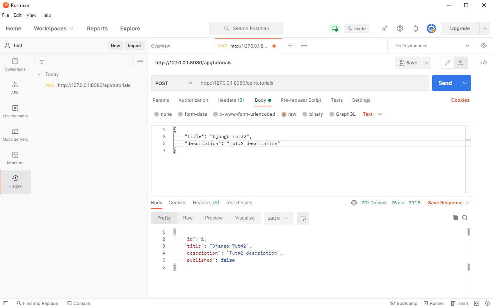
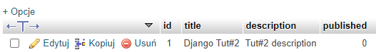
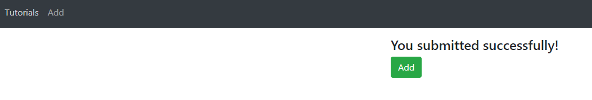

# Aplikacje internetowe Paweł Lipski 185IC Lab9

#### Django + React (aplikacja CRUD)
#### Wysyłanie zapytania POST.

#### Widok danych w `bazie danych.

#### Wprowadzanie danych do bazy danych przechodzi pomyślnie.

#### Lista z możliwością zobaczenia szczegółów wybranego elementu z listy.

